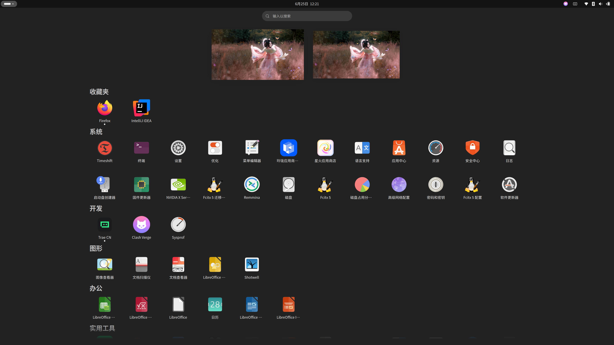

# Vertical App Grid
A GNOME Shell extension that turns the default horizontal app grid into a
vertical one. App icon size and spacing can be customized in the extension
preferences. The implementation is very basic, so drag-and-drop reordering and
app folders are currently not supported.

**2026-06-25 update**
- Add category grouping feature
- Add category grouping configuration
- Add Chinese translation

## Default layout

## Group layout by category

